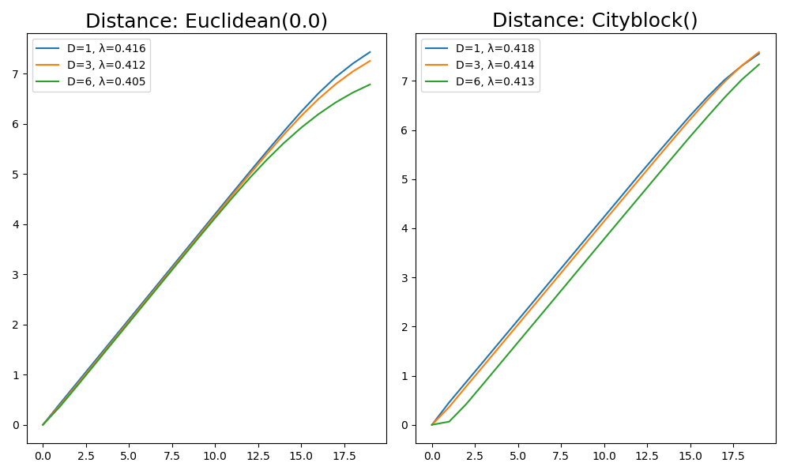
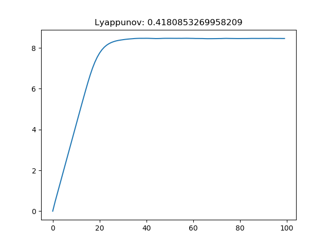
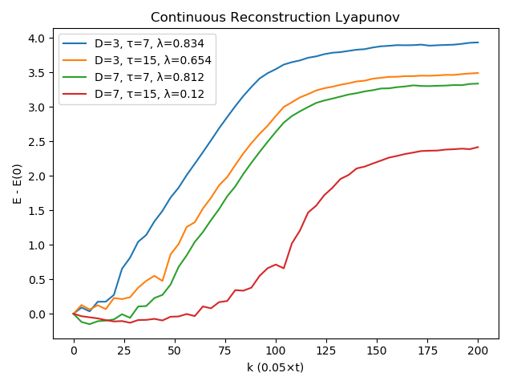
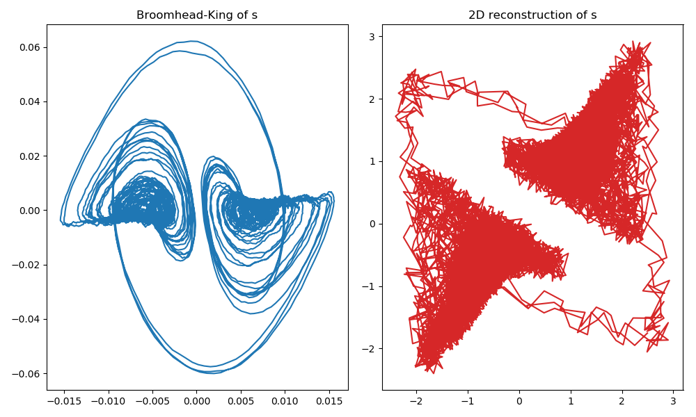

<a id='Nonlinear-Timeseries-Analysis-1'></a>

# Nonlinear Timeseries Analysis


<a id='Estimating-Reconstruction-Parameters-1'></a>

## Estimating Reconstruction Parameters


The following functions can estimate good values that can be used in [`reconstruct`](../definition/reconstruction.md#DynamicalSystemsBase.reconstruct) for either the delay time or the dimension.

<a id='ChaosTools.estimate_delay' href='#ChaosTools.estimate_delay'>#</a>
**`ChaosTools.estimate_delay`** &mdash; *Function*.


```
estimate_delay(s, method::String) -> τ
```

Estimate an optimal delay to be used in [`reconstruct`](../definition/reconstruction.md#DynamicalSystemsBase.reconstruct). Return the exponential decay time `τ` rounded to an integer.

The `method` can be one of the following:

  * `"first_zero"` : find first delay at which the auto-correlation function becomes 0.
  * `"first_min"` : return delay of first minimum of the auto-correlation function.
  * `"exp_decay"` : perform an exponential fit to the `abs.(c)` with `c` the auto-correlation function of `s`.
  * `"mutual_inf"` : return the first minimum of the mutual information function (see [`mutinfo_delaycurve`](nlts.md#ChaosTools.mutinfo_delaycurve)). This option also has the following keyword arguments:

      * `maxtau::Integer=100` : stops the delay calculations after the given `maxtau`.
      * `k::Integer=1` : the number of nearest-neighbors to include.

*WARNING* - `"mutual_inf"` has bad results with data from maps. In addition it is much slower than the other alternatives.

<a id='ChaosTools.estimate_dimension' href='#ChaosTools.estimate_dimension'>#</a>
**`ChaosTools.estimate_dimension`** &mdash; *Function*.


```
estimate_dimension(s::AbstractVector, τ:Int, Ds = 1:5) -> E₁s
```

Compute a quantity that can estimate an optimal amount of temporal neighbors `D` to be used in [`reconstruct`](../definition/reconstruction.md#DynamicalSystemsBase.reconstruct).

**Description**

Given the scalar timeseries `s` and the embedding delay `τ` compute the values of `E₁` for each `D ∈ Ds`, according to Cao's Method (eq. 3 of [1]). Please be aware that in **DynamicalSystems.jl** `D` stands for the amount of temporal neighbors, *not* the dimension as in [1]. The dimension is `D+1`.

Return the vector of all computed `E₁`s. To estimate a good value for `D` from this, find `D` for which the value `E₁` saturates at some value around 1.

*Note: This method does not work for datasets with perfectly periodic signals.*

**References**

[1] : Liangyue Cao, [Physica D, pp. 43-50 (1997)](https://www.sciencedirect.com/science/article/pii/S0167278997001188?via%3Dihub)

<a id='ChaosTools.stochastic_indicator' href='#ChaosTools.stochastic_indicator'>#</a>
**`ChaosTools.stochastic_indicator`** &mdash; *Function*.


```
stochastic_indicator(s::AbstractVector, τ:Int, Ds = 1:4) -> E₂s
```

Compute an estimator for apparent randomness in a reconstruction with `Ds` temporal neighbors.

**Description**

Given the scalar timeseries `s` and the embedding delay `τ` compute the values of `E₂` for each `D ∈ Ds`, according to Cao's Method (eq. 5 of [1]).

Use this function to confirm that the input signal is not random and validate the results of [`estimate_dimension`](nlts.md#ChaosTools.estimate_dimension). In the case of random signals, it should be `E₂ ≈ 1 ∀ D`.

**References**

[1] : Liangyue Cao, [Physica D, pp. 43-50 (1997)](https://www.sciencedirect.com/science/article/pii/S0167278997001188?via%3Dihub)


---


<a id='Mutual-Information-1'></a>

## Mutual Information


For one of the methods available to estimate the optimal delay time for [`reconstruct`](../definition/reconstruction.md#DynamicalSystemsBase.reconstruct), a method to compute the [Mutual Information](http://www.scholarpedia.org/article/Mutual_information) is necessary.

<a id='ChaosTools.mutinfo' href='#ChaosTools.mutinfo'>#</a>
**`ChaosTools.mutinfo`** &mdash; *Function*.


```
mutinfo(k, X1, X2[, ..., Xm]) -> MI
```

Calculate the mutual information `MI` of the given vectors `X1, X2, ...`, using `k` nearest-neighbors.

The method follows the second algorithm $I^{(2)}$ outlined by Kraskov in [1].

**References**

[1] : A. Kraskov *et al.*, [Phys. Rev. E **69**, pp 066138 (2004)](https://journals.aps.org/pre/abstract/10.1103/PhysRevE.69.066138)

**Performance Notes**

This functin gets very slow for large `k`.

See also [`estimate_delay`](nlts.md#ChaosTools.estimate_delay) and [`mutinfo_delaycurve`](nlts.md#ChaosTools.mutinfo_delaycurve).

<a id='ChaosTools.mutinfo_delaycurve' href='#ChaosTools.mutinfo_delaycurve'>#</a>
**`ChaosTools.mutinfo_delaycurve`** &mdash; *Function*.


```
mutinfo_delaycurve(x; maxtau=100, k=1)
```

Return the [`mutinfo`](nlts.md#ChaosTools.mutinfo) between `x` and itself for delays of `1:maxtau`.


!!! warn "Mutual Information is very slow!"
    Please be advised that the current implementation of [`mutinfo`](nlts.md#ChaosTools.mutinfo) is very slow for "normally" sized datasets.


<a id='Numerical-Lyapunov-Exponent-1'></a>

## Numerical Lyapunov Exponent


Given any timeseries, one can first [`reconstruct`](../definition/reconstruction.md#DynamicalSystemsBase.reconstruct) it using delay coordinates, and then calculate a maximum Lyapunov exponent for it. This is done with

<a id='ChaosTools.numericallyapunov' href='#ChaosTools.numericallyapunov'>#</a>
**`ChaosTools.numericallyapunov`** &mdash; *Function*.


```
numericallyapunov(R::Dataset, ks;  refstates, w, distance, ntype)
```

Return `E = [E(k) for k ∈ ks]`, where `E(k)` is the average logarithmic distance between states of a [`neighborhood`](../definition/dataset.md#DynamicalSystemsBase.neighborhood) that are evolved in time for `k` steps (`k` must be integer).

**Keyword Arguments**

  * `refstates = 1:(length(R) - ks[end])` : Vector of indices that notes which states of the reconstruction should be used as "reference states", which means that the algorithm is applied for all state indices contained in `refstates`.
  * `w::Int = 1` : The Theiler window, which determines whether points are separated enough in time to be considered separate trajectories (see [1] and [`neighborhood`](../definition/dataset.md#DynamicalSystemsBase.neighborhood)).
  * `ntype::AbstractNeighborhood = FixedMassNeighborhood(1)` : The method to be used when evaluating the neighborhood of each reference state. See [`AbstractNeighborhood`](../definition/dataset.md#DynamicalSystemsBase.AbstractNeighborhood) or [`neighborhood`](../definition/dataset.md#DynamicalSystemsBase.neighborhood) for more info.
  * `distance::Metric = Cityblock()` : The distance function used in the logarithmic distance of nearby states. The allowed distances are `Cityblock()` and `Euclidean()`. See below for more info.

**Description**

If the dataset/reconstruction exhibits exponential divergence of nearby states, then it should clearly hold

$$
E(k) \approx \lambda\Delta t k + E(0)
$$

for a *well defined region* in the `k` axis, where $\lambda$ is the approximated maximum Lyapunov exponent. $\Delta t$ is the time between samples in the original timeseries. You can use [`linear_region`](entropies.md#ChaosTools.linear_region) with arguments `(ks .* Δt, E)` to identify the slope (= $\lambda$) immediatelly, assuming you have choosen sufficiently good `ks` such that the linear scaling region is bigger than the saturated region.

The algorithm used in this function is due to Parlitz [1], which itself expands upon Kantz [2]. In sort, for each reference state a neighborhood is evaluated. Then, for each point in this neighborhood, the logarithmic distance between reference state and neighborhood state is calculated as the "time" index `k` increases. The average of the above over all neighborhood states over all reference states is the returned result.

If the `Metric` is `Euclidean()` then use the Euclidean distance of the full `D`-dimensional points (distance $d_E$ in ref. [1]). If however the `Metric` is `Cityblock()`, calculate the absolute distance of *only the first elements* of the `m+k` and `n+k` points of the reconstruction `R` (distance $d_F$ in ref. [1]).

**References**

[1] : Skokos, C. H. *et al.*, *Chaos Detection and Predictability* - Chapter 1 (section 1.3.2), Lecture Notes in Physics **915**, Springer (2016)

[2] : Kantz, H., Phys. Lett. A **185**, pp 77–87 (1994)


---


The function `numericallyapunov` has a total of 4 different approaches for the algorithmic process, by combining 2 types of distances with 2 types of neighborhoods.


<a id='Example-of-Numerical-Lyapunov-computation-1'></a>

### Example of Numerical Lyapunov computation


```julia
using DynamicalSystems, PyPlot

ds = Systems.henon()
data = trajectory(ds, 100000)
x = data[:, 1] #fake measurements for the win!

ks = 1:20
ℜ = 1:10000
fig = figure(figsize=(10,6))

for (i, di) in enumerate([Euclidean(), Cityblock()])
    subplot(1, 2, i)
    ntype = FixedMassNeighborhood(2)
    title("Distance: $(di)", size = 18)
    for D in [1, 3, 6]
        R = reconstruct(x, D, 1)
        E = numericallyapunov(R, ks;
        refstates = ℜ, distance = di, ntype = ntype)
        Δt = 1
        λ = linear_region(ks.*Δt, E)[2]
        # gives the linear slope, i.e. the Lyapunov exponent
        plot(ks .- 1, E .- E[1], label = "D=$D, λ=$(round(λ, digits = 3))")
        legend()
        tight_layout()
    end
end
```





<a id='Bad-Time-axis-(ks)-length-1'></a>

### Bad Time-axis (`ks`) length


!!! danger "Large `ks`"
    This simply cannot be stressed enough! It is just too easy to overshoot the range at which the exponential expansion region is valid!


Let's revisit the example of the previous section:


```julia
ds = Systems.henon()
data = trajectory(ds, 100000)
x = data[:, 1]
length(x)
```

```
100001
```


The timeseries of such length could be considered big. A time length of 100 seems very small. Yet it turns out it is way too big! The following


```julia
ks = 1:100
R = reconstruct(x, 1, 1)
E = numericallyapunov(R, ks, ntype = FixedMassNeighborhood(2))
figure()
plot(ks .- 1, E .- E[1])
title("Lyappunov: $(linear_region(ks, E)[2])")
```





Notice that even though this value for the Lyapunov exponent is correct, it happened to be correct simply due to the jitter of the saturated region. Since the saturated region is much bigger than the linear scaling region, if it wasn't that jittery the function [`linear_region`](entropies.md#ChaosTools.linear_region) would not give the scaling of the linear region, but instead a slope near 0! (or if you were to give bigger tolerance as a keyword argument)


<a id='Case-of-a-Continuous-system-1'></a>

### Case of a Continuous system


The process for continuous systems works identically with discrete, but one must be a bit more thoughtful when choosing parameters. The following example helps the users get familiar with the process:


```julia
using DynamicalSystems, PyPlot

ntype = FixedMassNeighborhood(5) #5 nearest neighbors of each state

ds = Systems.lorenz()
# create a timeseries of 1 dimension
dt = 0.05
x = trajectory(ds, 1000.0; dt = dt)[:, 1]
```

```
20001-element Array{Float64,1}:
  0.0
  4.2851781460745455
  8.9247806582301
 15.012201310538227
 20.055334268425792
 18.062349973396003
  9.898347024647947
  2.1991179513430605
 -2.6729672045417354
 -5.3381195991401595
  ⋮
  6.8930784959477
  8.363855695776378
 10.015287975904528
 11.394119858487318
 11.877939203648781
 11.113653906577763
  9.411003447073245
  7.493809022238821
  5.9452292192002645
```


We know that we have to use much bigger `ks` than `1:20`, because this is a continuous case! (See reference given in `numericallyapunovs`)


```julia
ks1 = 0:200
```

```
0:200
```


and in fact it is even better to not increment the `ks` one by one but instead do


```julia
ks2 = 0:4:200
```

```
0:4:200
```


Now we plot some example computations


```julia
figure()
for D in [3, 7], τ in [7, 15]
    r = reconstruct(x, D, τ)

    # E1 = numericallyapunov(r, ks1; ntype = ntype)
    # λ1 = linear_region(ks1 .* dt, E1)[2]
    E2 = numericallyapunov(r, ks2; ntype = ntype)
    λ2 = linear_region(ks2 .* dt, E2)[2]

    # plot(ks1,E1.-E1[1], label = "dense, D=$(D), τ=$(τ), λ=$(round(λ1, 3))")
    plot(ks2,E2.-E2[1], label = "D=$(D), τ=$(τ), λ=$(round(λ2, digits = 3))")
end

legend()
xlabel("k (0.05×t)")
ylabel("E - E(0)")
title("Continuous Reconstruction Lyapunov")
tight_layout()
```





As you can see, using `τ = 15` is not a great choice! The estimates with `τ = 7` though are very good (the actual value is around `λ ≈ 0.89...`).


<a id='Broomhead-King-Coordinates-1'></a>

## Broomhead-King Coordinates

<a id='ChaosTools.broomhead_king' href='#ChaosTools.broomhead_king'>#</a>
**`ChaosTools.broomhead_king`** &mdash; *Function*.


```
broomhead_king(s::AbstractVector, d::Int) -> U, S, Vtr
```

Return the Broomhead-King coordinates of a timeseries `s` by performing `svd` on the so-called trajectory matrix with dimension `d`.

**Description**

Broomhead and King coordinates is an approach proposed in [1] that applies the Karhunen–Loève theorem to delay coordinates embedding with smallest possible delay.

The function performs singular value decomposition on the `d`-dimensional trajectory matrix $X$ of $s$,

$$
X = \frac{1}{\sqrt{N}}\left(
\begin{array}{cccc}
x_1 & x_2 & \ldots & x_d \\
x_2 & x_3 & \ldots & x_{d+1}\\
\vdots & \vdots & \vdots & \vdots \\
x_{N-d+1} & x_{N-d+2} &\ldots & x_N
\end{array}
\right) = U\cdot S \cdot V^{tr}.
$$

where $x := s - \bar{s}$. The columns of $U$ can then be used as a new coordinate system, and by considering the values of the singular values $S$ you can decide how many columns of $U$ are "important". See the documentation page for example application.

**References**

[1] :  D. S. Broomhead, R. Jones and G. P. King, J. Phys. A **20**, 9, pp L563 (1987)


---


This alternative/improvement of the traditional delay coordinates can be a very powerful tool. An example where it shines is noisy data where there is the effect of superficial dimensions due to noise.


Take the following example where we produce noisy data from a system and then use Broomhead-King coordinates as an alternative to "vanilla" delay coordinates:


```julia
using DynamicalSystems, PyPlot

ds = Systems.gissinger()
data = trajectory(ds, 1000.0, dt = 0.05)
x = data[:, 1]

L = length(x)
s = x .+ 0.5rand(L) #add noise

U, S = broomhead_king(s, 40)
summary(U)
```

```
"19962×40 Array{Float64,2}"
```


Now let's simply compare the above result with the one you get from doing a "standard" call to [`reconstruct`](../definition/reconstruction.md#DynamicalSystemsBase.reconstruct):


```julia
figure(figsize= (10,6))
subplot(1,2,1)
plot(U[:, 1], U[:, 2])
title("Broomhead-King of s")

subplot(1,2,2)
R = reconstruct(s, 1, 30)
plot(columns(R)...; color = "C3")
title("2D reconstruction of s")
tight_layout()
```





we have used the same system as in the [delay coordinates reconstruction](/definition/reconstruction) example, and picked the optimal delay time of `τ = 30` (for same `dt = 0.05`). Regardless, the vanilla delay coordinates is much worse than the Broomhead-King coordinates.

