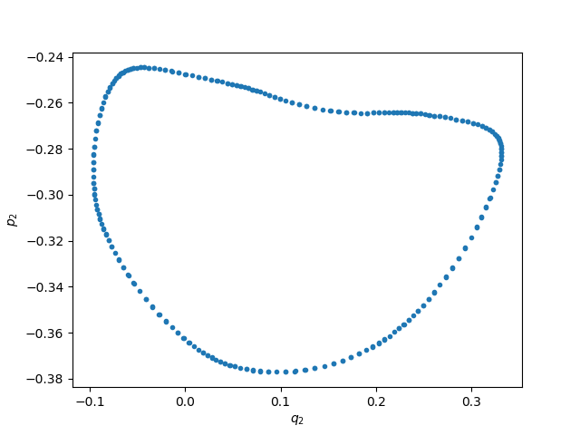
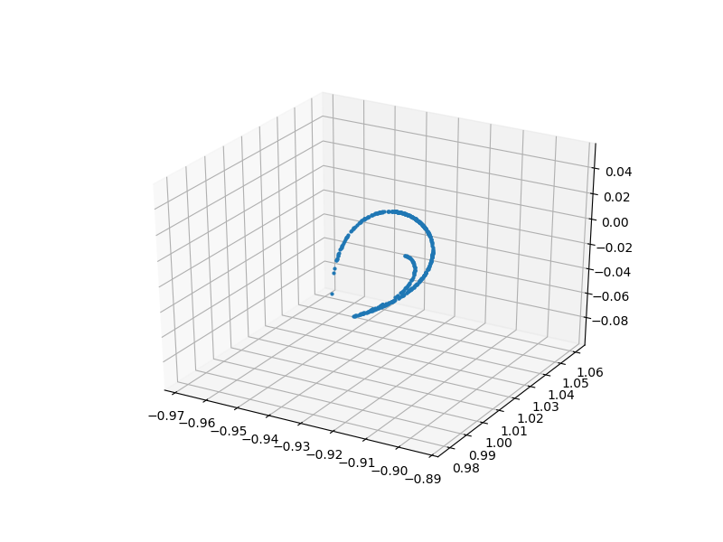
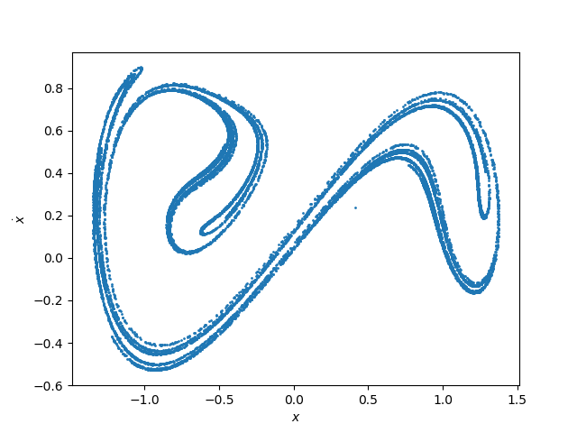
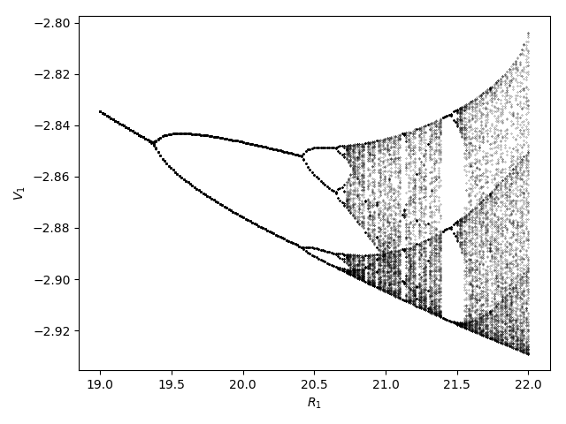

<a id='Orbit-Diagrams-of-Maps-1'></a>

## Orbit Diagrams of Maps


An orbit diagram (also called bifurcation diagram) is a way to visualize the asymptotic behavior of a map, when a parameter of the system is changed

<a id='ChaosTools.orbitdiagram' href='#ChaosTools.orbitdiagram'>#</a>
**`ChaosTools.orbitdiagram`** &mdash; *Function*.


```
orbitdiagram(ds::DiscreteDynamicalSystem, i, p_index, pvalues; kwargs...)
```

Compute the orbit diagram (also called bifurcation diagram) of the given system, saving the `i` variable(s) for parameter values `pvalues`. The `p_index` specifies which parameter of the equations of motion is to be changed.

`i` can be `Int` or `AbstractVector{Int}`. If `i` is `Int`, returns a vector of vectors. Else it returns vectors of vectors of vectors. Each entry are the points at each parameter value.

**Keyword Arguments**

  * `Ttr::Int = 1000` : Transient steps; each orbit is evolved for `Ttr` first before saving output.
  * `n::Int = 100` : Amount of points to save for each initial condition.
  * `dt = 1` : Stepping time. Changing this will give you the orbit diagram of the `dt` order map.
  * `u0 = get_state(ds)` : Initial condition. Besides a vector you can also give a vector of vectors such that `length(u0) == length(pvalues)`. Then each parameter has a different initial condition.

See also [`poincaresos`](orbitdiagram.md#ChaosTools.poincaresos) and [`produce_orbitdiagram`](orbitdiagram.md#ChaosTools.produce_orbitdiagram).


---


For example, let's compute the famous orbit diagram of the logistic map:


```julia
using DynamicalSystems
using PyPlot

ds = Systems.logistic()
i = 1
pvalues = 3:0.001:4
ics = [rand() for m in 1:10]
n = 2000
Ttr = 2000
p_index = 1
output = orbitdiagram(ds, i, p_index, pvalues; n = n, Ttr = Ttr)

L = length(pvalues)
x = Vector{Float64}(undef, n*L)
y = copy(x)
for j in 1:L
    x[(1 + (j-1)*n):j*n] .= pvalues[j]
    y[(1 + (j-1)*n):j*n] .= output[j]
end

figure()
PyPlot.title("total points: $(L*n)")
plot(x, y, ls = "None", ms = 0.5, color = "black", marker = "o", alpha = 0.05)
xlim(pvalues[1], pvalues[end]); ylim(0,1)
xlabel("\$r\$"); ylabel("\$x\$")
tight_layout()
```


Notice that if you are using `PyPlot`, the plotting process will be slow, since it is slow at plotting big numbers of points.


The function is not limited to 1D maps, and can be applied just as well to any discrete system.


<a id='Poincaré-Surface-of-Section-1'></a>

## Poincaré Surface of Section


Also called [Poincaré map](https://en.wikipedia.org/wiki/Poincar%C3%A9_map) is a technique to reduce a continuous system into a discrete map with 1 less dimension. We are doing this using the function:

<a id='ChaosTools.poincaresos' href='#ChaosTools.poincaresos'>#</a>
**`ChaosTools.poincaresos`** &mdash; *Function*.


```
poincaresos(ds::ContinuousDynamicalSystem, plane, tfinal = 1000.0; kwargs...)
```

Calculate the Poincaré surface of section (also called Poincaré map) [1, 2] of the given system with the given `plane`. The system is evolved for total time of `tfinal`.

If the state of the system is $\mathbf{u} = (u_1, \ldots, u_D)$ then the equation intersecting the hyperplane is

$$
a_1u_1 + \dots + a_Du_D = \mathbf{a}\cdot\mathbf{u}=b
$$

where $\mathbf{a}, b$ are the parameters that define the hyperplane.

In code, `plane` can be either:

  * A `Tuple{Int, <: Number}`, like `(j, r)` : the planecrossing is defined as when the `j` variable of the system crosses the value `r`.
  * An `AbstractVector` of length `D+1`. The first `D` elements of the vector correspond to $\mathbf{a}$ while the last element is $b$.

Returns a [`Dataset`](../definition/dataset.md#DynamicalSystemsBase.Dataset) of the points that are on the surface of section.

**Keyword Arguments**

  * `direction = 1` : Only crossings with `sign(direction)` are considered to belong to the surface of section. Positive direction means going from less than $b$ to greater than $b$.
  * `idxs = 1:dimension(ds)` : Optionally you can choose which variables to save. Defaults to the entire state.
  * `Ttr = 0.0` : Transient time to evolve the system before starting to compute the PSOS.
  * `warning = true` : Throw a warning if the Poincaré section was empty.
  * `rootkw = (xrtol = 1e-6, atol = 1e-6)` : A `NamedTuple` of keyword arguments passed to `find_zero` from [Roots.jl](https://github.com/JuliaMath/Roots.jl).
  * `diffeq...` : All other extra keyword arguments are propagated into `init` of DifferentialEquations.jl. See [`trajectory`](../definition/evolve.md#DynamicalSystemsBase.trajectory) for examples.

**References**

[1] : H. Poincaré, *Les Methods Nouvelles de la Mécanique Celeste*, Paris: Gauthier-Villars (1892)

[2] : M. Tabor, *Chaos and Integrability in Nonlinear Dynamics: An Introduction*, §4.1, in pp. 118-126, New York: Wiley (1989)

See also [`orbitdiagram`](orbitdiagram.md#ChaosTools.orbitdiagram), [`produce_orbitdiagram`](orbitdiagram.md#ChaosTools.produce_orbitdiagram).


---


An example of the [Henon-Heiles](/definition/predefined/#DynamicalSystemsBase.Systems.henonheiles) system using a quasi-periodic solution


```julia
ds = Systems.henonheiles([0., 0.1, 0.5, 0.])
output = poincaresos(ds, (3, 0.0), 2000.0)

figure()
plot(output[:, 2], output[:, 4], lw = 0.0, marker=".")
xlabel("\$q_2\$"); ylabel("\$p_2\$");
```





Here the surface of section was the (hyper-) plane that $p_1 = 0$. As expected the section is 1-dimensional, because the torus the solution lives in is 2-dimensional. if we produced the PSOS for much longer times, the result would be a filled line instead of individual points.


---


One more example with a more complex hyperplane:


```julia
gis = Systems.gissinger([2.32865, 2.02514, 1.98312])

# Define appropriate hyperplane for gissinger system
const ν = 0.1
const Γ = 0.9 # default parameters of the system

# I want hyperperplane defined by these two points:
Np(μ) = SVector{3}(sqrt(ν + Γ*sqrt(ν/μ)), -sqrt(μ + Γ*sqrt(μ/ν)), -sqrt(μ*ν))
Nm(μ) = SVector{3}(-sqrt(ν + Γ*sqrt(ν/μ)), sqrt(μ + Γ*sqrt(μ/ν)), -sqrt(μ*ν))

# Create hyperplane using normal vector to vector connecting points:
gis_plane(μ) = (d = (Np(μ) - Nm(μ)); [d[2], -d[1], 0, 0])

μ = 0.12
set_parameter!(gis, 1, μ)
figure(figsize = (8,6))
psos = poincaresos(gis, gis_plane(μ), 5000.0, Ttr = 200.0, direction = -1)
plot3D(columns(psos)..., marker = "o", ls = "None", ms = 2.0);
```





<a id='Stroboscopic-Map-1'></a>

### Stroboscopic Map


A special case of a PSOS is a stroboscopic map, which is defined for non-autonomous systems with periodic time dependence, like e.g. the [Duffing oscillator](/definition/predefined/#DynamicalSystemsBase.Systems.duffing).


A "cut" through the phase-space can be produced at every period $T = 2\pi/\omega$. There is no reason to use `poincaresos` for this though, because you can simply use [`trajectory`](../definition/evolve.md#DynamicalSystemsBase.trajectory) and get the solution with a certain time sampling rate:


```julia
ds = Systems.duffing(β = -1, ω = 1, f = 0.3) # non-autonomous chaotic system
a = trajectory(ds, 100000.0, dt = 2π) # every period T = 2π/ω
figure()
plot(a[:, 1], a[:, 2], lw = 0, marker ="o", ms = 1)
xlabel("\$x\$"); ylabel("\$\\dot{x}\$")
```





<a id='Producing-Orbit-Diagrams-for-Flows-1'></a>

## Producing Orbit Diagrams for Flows


The [`orbitdiagram`](orbitdiagram.md#ChaosTools.orbitdiagram) does not make much sense for continuous systems, besides the trivial case where the system is at a fixed point. In order for [`orbitdiagram`](orbitdiagram.md#ChaosTools.orbitdiagram) to have meaning one must have a map.


If only there was a way to turn a continuous system into a map... **OH WAIT!** That is what [`poincaresos`](orbitdiagram.md#ChaosTools.poincaresos) does! By performing successive surfaces of section at different parameter values, one can indeed "produce" an orbit diagram for a flow.


We have bundled this process in the following function:

<a id='ChaosTools.produce_orbitdiagram' href='#ChaosTools.produce_orbitdiagram'>#</a>
**`ChaosTools.produce_orbitdiagram`** &mdash; *Function*.


```
produce_orbitdiagram(ds::ContinuousDynamicalSystem, plane, i::Int,
                     p_index, pvalues; kwargs...)
```

Produce an orbit diagram (also called bifurcation diagram) for the `i` variable(s) of the given continuous system by computing Poincaré surfaces of section using `plane` for the given parameter values (see [`poincaresos`](orbitdiagram.md#ChaosTools.poincaresos)).

`i` can be `Int` or `AbstractVector{Int}`. If `i` is `Int`, returns a vector of vectors. Else it returns vectors of vectors of vectors. Each entry are the points at each parameter value.

**Keyword Arguments**

  * `printparams::Bool = false` : Whether to print the parameter used during computation in order to keep track of running time.
  * `direction, warning, Ttr, rootkw, diffeq...` : Propagated into [`poincaresos`](orbitdiagram.md#ChaosTools.poincaresos).
  * `u0 = get_state(ds)` : Initial condition. Besides a vector you can also give a vector of vectors such that `length(u0) == length(pvalues)`. Then each parameter has a different initial condition.

**Description**

For each parameter, a PSOS reduces the system from a flow to a map. This then allows the formal computation of an "orbit diagram" for the `i` variable of the system, just like it is done in [`orbitdiagram`](orbitdiagram.md#ChaosTools.orbitdiagram).

The parameter change is done as `p[p_index] = value` taking values from `pvalues` and thus you must use a parameter container that supports this (either `Array`, `LMArray`, dictionary or other).

See also [`poincaresos`](orbitdiagram.md#ChaosTools.poincaresos), [`orbitdiagram`](orbitdiagram.md#ChaosTools.orbitdiagram).


---


For example, we will calculate the orbit diagram of the Shinriki oscillator, a continuous system that undergoes a period doubling route to chaos, much like the logistic map!


```julia
ds = Systems.shinriki([-2, 0, 0.2])

pvalues = range(19, stop = 22, length = 201)
i = 1
plane = (2, 0.0)
tf = 200.0
p_index = 1

output = produce_orbitdiagram(ds, plane, i, p_index, pvalues; tfinal = tf,
Ttr = 200.0, direction = -1, printparams = false)

figure()
for (j, p) in enumerate(pvalues)
    plot(fill(p, length(output[j])), output[j], lw = 0,
    marker = "o", ms = 0.2, color = "black")
end
xlabel("\$R_1\$"); ylabel("\$V_1\$")
tight_layout()
```




