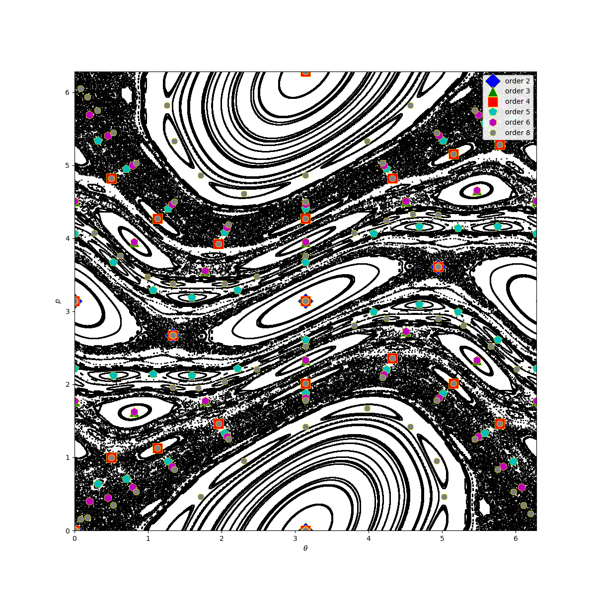

<a id='Detecting-Stable-and-Unstable-Periodic-Orbits-of-Maps-1'></a>

## Detecting Stable and Unstable Periodic Orbits of Maps


Chaotic behavior of low dimensional dynamical systems is affected by the position and the stability properties of the [periodic orbits](http://www.scholarpedia.org/article/Unstable_periodic_orbits) existing in the chaotic sea.


Finding unstable (or stable) periodic orbits of a discrete mapping analytically rapidly becomes impossible for higher orders of fixed points. Fortunately there is a numeric algorithm due to Schmelcher & Diakonos which allows such a computation. Notice that even though the algorithm can find stable fixed points, it is mainly aimed at *unstable* ones.


The functions `periodicorbits` and `lambdamatrix` implement the algorithm:

<a id='ChaosTools.periodicorbits' href='#ChaosTools.periodicorbits'>#</a>
**`ChaosTools.periodicorbits`** &mdash; *Function*.


```
periodicorbits(ds::DiscreteDynamicalSystem,
               o, ics [, λs, indss, singss]; kwargs...) -> FP
```

Find fixed points `FP` of order `o` for the map `ds` using the algorithm due to Schmelcher & Diakonos [1]. `ics` is a collection of initial conditions (container of vectors) to be evolved.

**Optional Arguments**

The optional arguments `λs, indss, singss` *must be containers* of appropriate values, besides `λs` which can also be a number. The elements of those containers are passed to: [`lambdamatrix(λ, inds, sings)`](periodicity.md#ChaosTools.lambdamatrix), which creates the appropriate $\mathbf{\Lambda}_k$ matrix. If these arguments are not given, a random permutation will be chosen for them, with `λ=0.001`.

**Keyword Arguments**

  * `maxiters::Int = 100000` : Maximum amount of iterations an i.c. will be iterated  before claiming it has not converged.
  * `disttol = 1e-10` : Distance tolerance. If the 2-norm of a previous state with  the next one is `≤ disttol` then it has converged to a fixed point.
  * `inftol = 10.0` : If a state reaches `norm(state) ≥ inftol` it is assumed that  it has escaped to infinity (and is thus abandoned).
  * `roundtol::Int = 4` : The found fixed points are rounded  to `roundtol` digits before pushed into the list of returned fixed points `FP`,  *if* they are not already contained in `FP`.  This is done so that `FP` doesn't contain duplicate fixed points (notice  that this has nothing to do with `disttol`). Turn this to `typemax(Int)`  to get the full precision of the algorithm.

**Description**

The algorithm used can detect periodic orbits by turning fixed points of the original map `ds` to stable ones, through the transformation

$$
\mathbf{x}_{n+1} = \mathbf{x}_n +
\mathbf{\Lambda}_k\left(f^{(o)}(\mathbf{x}_n) - \mathbf{x}_n\right)
$$

with $f$ = `eom`. The index $k$ counts the various possible $\mathbf{\Lambda}_k$.

**Performance Notes**

*All* initial conditions are evolved for *all* $\mathbf{\Lambda}_k$ which can very quickly lead to long computation times.

**References**

[1] : P. Schmelcher & F. K. Diakonos, Phys. Rev. Lett. **78**, pp 4733 (1997)

<a id='ChaosTools.lambdamatrix' href='#ChaosTools.lambdamatrix'>#</a>
**`ChaosTools.lambdamatrix`** &mdash; *Function*.


```
lambdamatrix(λ, inds::Vector{Int}, sings) -> Λk
```

Return the matrix $\mathbf{\Lambda}_k$ used to create a new dynamical system with some unstable fixed points turned to stable in the function [`periodicorbits`](periodicity.md#ChaosTools.periodicorbits).

**Arguments**

1. `λ<:Real` : the multiplier of the $C_k$ matrix, with `0<λ<1`.
2. `inds::Vector{Int}` : The `i`th entry of this vector gives the *row* of the nonzero element of the `i`th column of $C_k$.
3. `sings::Vector{<:Real}` : The element of the `i`th column of $C_k$ is +1 if `signs[i] > 0` and -1 otherwise (`sings` can also be `Bool` vector).

Calling `lambdamatrix(λ, D::Int)` creates a random $\mathbf{\Lambda}_k$ by randomly generating an `inds` and a `signs` from all possible combinations. The *collections* of all these combinations can be obtained from the function [`lambdaperms`](periodicity.md#ChaosTools.lambdaperms).

**Description**

Each element of `inds` *must be unique* such that the resulting matrix is orthogonal and represents the group of special reflections and permutations.

Deciding the appropriate values for `λ, inds, sings` is not trivial. However, in ref. [2] there is a lot of information that can help with that decision. Also, by appropriately choosing various values for `λ`, one can sort periodic orbits from e.g. least unstable to most unstable, see [3] for details.

**References**

[2] : D. Pingel *et al.*, Phys. Rev. E **62**, pp 2119 (2000)

[3] : F. K. Diakonos *et al.*, Phys. Rev. Lett. **81**, pp 4349 (1998)

<a id='ChaosTools.lambdaperms' href='#ChaosTools.lambdaperms'>#</a>
**`ChaosTools.lambdaperms`** &mdash; *Function*.


```
lambdaperms(D) -> indperms, singperms
```

Return two collections that each contain all possible combinations of indices (total of $D!$) and signs (total of $2^D$) for dimension `D` (see [`lambdamatrix`](periodicity.md#ChaosTools.lambdamatrix)).


---


<a id='Standard-Map-example-1'></a>

### Standard Map example


For example, let's find the fixed points of the [Standard Map](system_definition/#DynamicalSystems.Systems.standardmap) of order 2, 3, 4, 5, 6 and 8. We will use all permutations for the `signs` but only one for the `inds`. We will also only use one `λ` value, and a 21×21 density of initial conditions.


First, initialize everything


```julia
using DynamicalSystems, PyPlot, StaticArrays

ds = Systems.standardmap()
xs = range(0, stop = 2π, length = 21); ys = copy(xs)
ics = [SVector{2}(x,y) for x in xs for y in ys]

# All permutations of [±1, ±1]:
singss = lambdaperms(2)[2] # second entry are the signs

# I know from personal research I only need this `inds`:
indss = [[1,2]] # <- must be container of vectors!!!

λs = 0.005 # <- only this allowed to not be vector (could also be vector)

orders = [2, 3, 4, 5, 6, 8]
ALLFP = Dataset{2, Float64}[];
```


Then, do the necessary computations for all orders


```julia
ttt = time()
for o in orders
    FP = periodicorbits(ds, o, ics, λs, indss, singss)
    push!(ALLFP, FP)
end
println("Total time, including compilation: $((time() - ttt)/60) mins.")
```

```
Total time, including compilation: 0.5686473846435547 mins.
```


Plot the phase space of the standard map


```julia
iters = 1000
dataset = trajectory(ds, iters)
for x in xs
    for y in ys
        append!(dataset, trajectory(ds, iters, SVector{2}(x, y)))
    end
end
figure(figsize = (12,12))
m = Matrix(dataset)
PyPlot.scatter(view(m, :, 1), view(m, :, 2), s= 1, color = "black")
PyPlot.xlim(xs[1], xs[end])
PyPlot.ylim(ys[1], ys[end]);
```


and finally, plot the fixed points


```julia
markers = ["D", "^", "s", "p", "h", "8"]
colors = ["b", "g", "r", "c", "m", "grey"]

for i in 1:6
    FP = ALLFP[i]
    o = orders[i]
    PyPlot.plot(columns(FP)...,
    marker=markers[i], color = colors[i], markersize=10.0 + (8-o), linewidth=0.0,
    label = "order $o", markeredgecolor = "yellow", markeredgewidth = 0.5)
end
legend(loc="upper right", framealpha=0.9)
xlabel("\$\\theta\$")
ylabel("\$p\$")
```





You can confirm for yourself that this is correct, for many reasons:


1. It is the same [fig. 12 of this publication](https://journals.aps.org/pre/abstract/10.1103/PhysRevE.92.012914).
2. Fixed points of order $n$ are also fixed points of order $2n, 3n, 4n, ...$
3. Besides fixed points of previous orders, *original* fixed points of order $n$ come in (possible multiples of) $2n$-sized pairs (see e.g. order 5). This is a direct consequence of the Poincaré–Birkhoff theorem.

