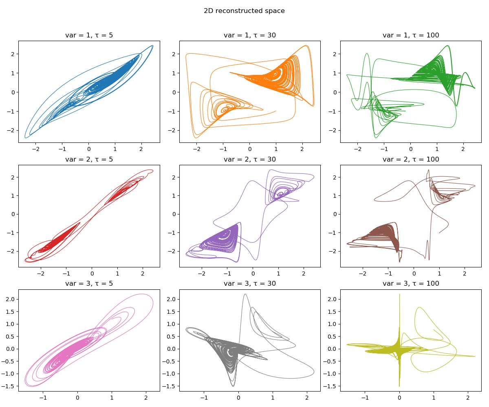

A timeseries recorded in some manner from a dynamical system can be used to gain information about the dynamics of the entire phase-space of the system. This can be done by reconstructing a new phase-space from the timeseries. One method that can do this is what is known as [delay coordinates embedding](https://en.wikipedia.org/wiki/Takens%27_theorem) or delay coordinates *reconstruction*.


This is done through the `reconstruct` interface:

<a id='DynamicalSystemsBase.reconstruct' href='#DynamicalSystemsBase.reconstruct'>#</a>
**`DynamicalSystemsBase.reconstruct`** &mdash; *Function*.


```
reconstruct(s, D, τ)
```

Reconstruct `s` using the delay coordinates embedding with `D` temporal neighbors and delay `τ` and return the result as a [`Dataset`](dataset.md#DynamicalSystemsBase.Dataset).

**Description**

**Single Timeseries**

If `τ` is an integer, then the $n$-th entry of the embedded space is

$$
(s(n), s(n+\tau), s(n+2\tau), \dots, s(n+D\tau))
$$

If instead `τ` is a vector of integers, so that `length(τ) == D`, then the $n$-th entry is

$$
(s(n), s(n+\tau[1]), s(n+\tau[2]), \dots, s(n+\tau[D]))
$$

The reconstructed dataset can have same invariant quantities (like e.g. lyapunov exponents) with the original system that the timeseries were recorded from, for proper `D` and `τ` [1, 2]. The case of different delay times allows reconstructing systems with many time scales, see [3].

*Notice* - The dimension of the returned dataset is `D+1`!

**Multiple Timeseries**

To make a reconstruction out of a multiple timeseries (i.e. trajectory) the number of timeseries must be known by type, so `s` can be either:

  * `s::AbstractDataset{B}`
  * `s::SizedAray{A, B}`

If the trajectory is for example $(x, y)$ and `τ` is integer, then the $n$-th entry of the embedded space is

$$
(x(n), y(n), x(n+\tau), y(n+\tau), \dots, x(n+D\tau), y(n+D\tau))
$$

If `τ` is an `AbstractMatrix{Int}`, so that `size(τ) == (D, B)`, then we have

$$
(x(n), y(n), x(n+\tau[1, 1]), y(n+\tau[1, 2]), \dots, x(n+\tau[D, 1]), y(n+\tau[D, 2]))
$$

*Notice* - The dimension of the returned dataset is `(D+1)*B`!

**References**

[1] : F. Takens, *Detecting Strange Attractors in Turbulence — Dynamical Systems and Turbulence*, Lecture Notes in Mathematics **366**, Springer (1981)

[2] : T. Sauer *et al.*, J. Stat. Phys. **65**, pp 579 (1991)

[3] : K. Judd & A. Mees, [Physica D **120**, pp 273 (1998)](https://www.sciencedirect.com/science/article/pii/S0167278997001188)


```
reconstruct(s::AbstractArray{<:AbstractArray{T,Φ}}, em)
```

Reconstruct the spatial timeseries `s` represented by a `Vector` of `AbstractArray` states using the embedding struct `em` of type [`AbstractSpatialEmbedding`](../tsprediction/spatiotemporal.md#TimeseriesPrediction.AbstractSpatialEmbedding).

Returns the reconstruction in the form of a [`Dataset`](dataset.md#DynamicalSystemsBase.Dataset) where each row is a reconstructed state and they are ordered first through linear indexing into each state and then incrementing in time.


---


Here are some examples of `reconstruct`ing a 3D continuous chaotic system:


```julia
using DynamicalSystems, PyPlot

ds = Systems.gissinger(ones(3))
data = trajectory(ds, 1000.0, dt = 0.05)

xyz = columns(data)

figure(figsize = (12,10))
k = 1
for i in 1:3
    for τ in [5, 30, 100]
        R = reconstruct(xyz[i], 1, τ)
        ax = subplot(3,3,k)
        plot(R[:, 1], R[:, 2], color = "C$(k-1)", lw = 0.8)
        title("var = $i, τ = $τ")
        global k+=1
    end
end

tight_layout()
suptitle("2D reconstructed space")
subplots_adjust(top=0.9)
```





!!! note "`τ` and `dt`"
    Keep in mind that whether a value of `τ` is "reasonable" for continuous systems depends on `dt`. In the above example the value `τ=30` is good, *only* for the case of using `dt = 0.05`. For shorter/longer `dt` one has to adjust properly `τ` so that their product `τ*dt` is the same.


You can also `reconstruct` multidimensional timeseries. For this to be possible, the number of timeseries must be known by Type:


```@example reconstructed
using StaticArrays: Size
a = rand(1000, 3) # my trajectory

A = Size(1000, 3)(a) # create array with the size as Type information
R = reconstruct(A, 2, 2) #aaaall good
```


```julia
ds = Systems.towel(); tr = trajectory(ds, 10000)
R = reconstruct(tr, 2, 2) # Dataset size is also known by Type!
```

```
9-dimensional Dataset{Float64} with 9997 points
 0.085     -0.121       0.075     …  0.837347   0.0372633   0.555269
 0.285813  -0.0675286   0.238038     0.51969    0.0616256   0.940906
 0.76827   -0.038933    0.672094     0.966676  -0.00171595  0.2225
 0.681871   0.0508933   0.825263     0.112748   0.0674955   0.653573
 0.837347   0.0372633   0.555269     0.386547  -0.0886542   0.869349
 0.51969    0.0616256   0.940906  …  0.910741  -0.0316828   0.411607
 0.966676  -0.00171595  0.2225       0.306095   0.0689305   0.909129
 0.112748   0.0674955   0.653573     0.824263  -0.056185    0.326064
 0.386547  -0.0886542   0.869349     0.545332   0.0508239   0.819404
 0.910741  -0.0316828   0.411607     0.954994   0.00453815  0.569534
 ⋮                                ⋱
 0.914702  -0.0315439   0.294266     0.90246    0.0242141   0.539502
 0.289932   0.0641239   0.778698     0.335976   0.0735803   0.943945
 0.793854  -0.0552801   0.664223     0.86657   -0.0497658   0.214728
 0.62671    0.0557527   0.832001     0.430816   0.0535742   0.62743
 0.90246    0.0242141   0.539502  …  0.936955  -0.0200112   0.894333
 0.335976   0.0735803   0.943945     0.237481   0.0983265   0.353212
 0.86657   -0.0497658   0.214728     0.681538  -0.0476555   0.883219
 0.430816   0.0535742   0.62743      0.836353   0.0363264   0.380351
 0.936955  -0.0200112   0.894333     0.515471   0.0534613   0.898152
```

