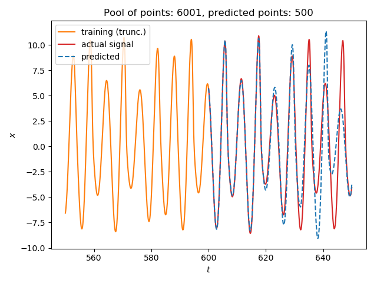

<a id='Local-Modeling-1'></a>

# Local Modeling


!!! tip "Reconstruction parameters"
    Don't forget that **DynamicalSystems.jl** also has functions for estimating good parameters for delay embedding: [`estimate_delay`](../chaos/nlts.md#ChaosTools.estimate_delay) and [`estimate_dimension`](../chaos/nlts.md#ChaosTools.estimate_dimension).


<a id='Local-Model-Prediction-1'></a>

## Local Model Prediction

<a id='TimeseriesPrediction.localmodel_tsp' href='#TimeseriesPrediction.localmodel_tsp'>#</a>
**`TimeseriesPrediction.localmodel_tsp`** &mdash; *Function*.


```
localmodel_tsp(s, D::Int, τ, p::Int; method, ntype, stepsize)
localmodel_tsp(s, p::Int; method, ntype, stepsize)
```

Perform a timeseries prediction for `p` points, using local weighted modeling [1]. The function always returns an object of the same type as `s`, which can be either a timeseries (vector) or an `AbstractDataset` (trajectory), and the returned data always contains the final point of `s` as starting point. This means that the returned data has length of `p + 1`.

If given `(s, D, τ)`, it first calls [`reconstruct`](../definition/reconstruction.md#DynamicalSystemsBase.reconstruct) on `s` with dimension `D` and delay `τ`. If given only `s` then no reconstruction is done.

**Keyword Arguments**

  * `method = AverageLocalModel(ω_unsafe)` : Subtype of [`AbstractLocalModel`](localmodels.md#TimeseriesPrediction.AbstractLocalModel).
  * `ntype = FixedMassNeighborhood(2)` : Subtype of [`AbstractNeighborhood`](../definition/dataset.md#DynamicalSystemsBase.AbstractNeighborhood).
  * `stepsize = 1` : Prediction step size.

**Description**

Given a query point, the function finds its neighbors using neighborhood `ntype`. Then, the neighbors `xnn` and their images `ynn` are used to make a prediction for the future of the query point, using the provided `method`. The images `ynn` are the points `xnn` shifted by `stepsize` into the future.

The algorithm is applied iteratively until a prediction of length `p` has been created, starting with the query point to be the last point of the timeseries.

**References**

[1] : D. Engster & U. Parlitz, *Handbook of Time Series Analysis* Ch. 1, VCH-Wiley (2006)

<a id='TimeseriesPrediction.AbstractLocalModel' href='#TimeseriesPrediction.AbstractLocalModel'>#</a>
**`TimeseriesPrediction.AbstractLocalModel`** &mdash; *Type*.


```
AbstractLocalModel
```

Supertype of methods for making a prediction of a query point `q` using local models, following the methods of [1]. Concrete subtypes are `AverageLocalModel` and `LinearLocalModel`.

All models weight neighbors with a chosen function, so that distant neighbors have smaller impact on the prediction and so that the interpolation is smooth. The default weighting function we use is

$$
\begin{aligned}
ω_i(d_i,d_{max}) = \left[ 1- \left(\frac{d_i}{d_{max}}\right)^2\right]^4
\end{aligned}
$$

with $d_i = ||x_{nn,i} -q||_2$ being the distance of each neighbor from the query point.

You can also provide your own function or give `ω_safe(d, dmax) = dmax > 0 ? (1.1 - (d/dmax)^2)^4 : 1.0` for a safe version of $ω$ that takes into acount edge cases. Finally you can also give `nothing` in place of `ω`. In that case no weighting is done and direct average of neighbors is returned.

**Average Local Model**

```
AverageLocalModel(ω)
```

The prediction is simply the weighted average of the images $y_{nn, i}$ of the neighbors $x_{nn, i}$ of the query point `q`, weighting using given function `ω`

$$
\begin{aligned}
y_{pred} = \frac{\sum{\omega_i y_{nn,i}}}{\sum{\omega_i}}
\end{aligned}
$$

**Linear Local Model**

```
LinearLocalModel([ω ], μ::Real=2.])
LinearLocalModel([ω ], s_min::Real, s_max::Real)
```

The prediction is a weighted linear regression over the neighbors $x_{nn, i}$ of the query and their images $y_{nn,i}$ as shown in [1].

Giving either `μ` or `s_min` and `s_max` determines which type of regularization is applied.

  * `μ` : Ridge Regression

    $$
    \begin{aligned}
    f(\sigma) = \frac{\sigma^2}{\mu^2 + \sigma^2}
    \end{aligned}
    $$
  * `s_min`, `s_max` : Soft Threshold

    $$
    \begin{aligned}
    f(\sigma) = \begin{cases} 0, & \sigma < s_{min}\\
    \left(1 - \left( \frac{s_{max}-\sigma}{s_{max}-s_{min}}\right)^2 \right)^2,
    &s_{min} \leq \sigma \leq s_{max} \\
    1, & \sigma > s_{max}\end{cases}
    \end{aligned}
    $$

**References**

[1] : D. Engster & U. Parlitz, *Handbook of Time Series Analysis* Ch. 1, VCH-Wiley (2006)


<a id='Single-Timeseries-Example-1'></a>

## Single Timeseries Example


We will predict the future of a (relatively simple) timeseries:


```julia
using TimeseriesPrediction # Re-exports DynamicalSystemsBase

ds = Systems.roessler(0.1ones(3))
dt = 0.1
data = trajectory(ds, 1000; dt=dt)
N_train = 6001
s_train = data[1:N_train, 1]
s_test  = data[N_train:end,1]

ntype = FixedMassNeighborhood(3)

p = 500
s_pred = localmodel_tsp(s_train, 4, 15, p; ntype=ntype)

using PyPlot
figure()
plot(550:dt:600, s_train[5501:end], label = "training (trunc.)", color = "C1")
plot(600:dt:(600+p*dt), s_test[1:p+1], color = "C3", label = "actual signal")
plot(600:dt:(600+p*dt), s_pred, color = "C0", ls="--", label="predicted")

title("Pool of points: $(N_train), predicted points: $(p)")
xlabel("\$t\$"); ylabel("\$x\$")
legend(loc="upper left")
tight_layout()
```





<a id='Multiple-Timeseries-Example-1'></a>

## Multiple Timeseries Example


Predicting multivariate timeseries works the same as with scalar timeseries.


```julia
using TimeseriesPrediction

ds = Systems.roessler(ones(3))
dt = 0.1
data = trajectory(ds, 1000; dt=dt)
N_train = 1501
s_train = data[1:N_train, SVector(1,2)]
#Identical to data[1:N_train, 1:2] but much faster
s_test  = data[N_train:end, SVector(1,2)]

p = 100; stepsize = 5
s_pred_10 = localmodel_tsp(s_train, 3, 15, p;  stepsize = stepsize)

using PyPlot; figure(figsize=(12,6))

idx_prev = 200 # how many previous points to show
tf = Int((N_train - 1)*dt) # final time of test set

# Plot real x-coordinate
plot((tf - idx_prev*dt):dt:tf, s_train[N_train-idx_prev:end,1],
    label = "real x", color = "C1")
plot(tf:dt:(tf+p*dt*stepsize), s_test[1:p*stepsize+1,1], color = "C1")
# Plot predicted x-coordinate
plot(tf:dt*stepsize:(tf+p*dt*stepsize), s_pred_10[:,1], color = "C3",
lw=0.5, marker="s", ms = 4.0, label="pred. x", alpha = 0.75)

# Plot real y-coordinate
plot((tf - idx_prev*dt):dt:tf, s_train[N_train-idx_prev:end,2],
    label = "real y", color = "C0")
plot(tf:dt:(tf+p*dt*stepsize), s_test[1:p*stepsize+1,2], color = "C0")
# Plot predicted y-coordinate
plot(tf:dt*stepsize:(tf+p*dt*stepsize), s_pred_10[:,2], color = "C9",
lw=0.5, marker="s", ms = 4.0, label="pred. y", alpha = 0.75)

# Plot start of prediction
plot([tf,tf],[-12,12], "--", color="black", alpha = 0.5)

title("Pool of points: $(N_train), predicted points: $(p)")
xlabel("\$t\$"); ylabel("\$x, y\$")
legend(loc="upper left")
tight_layout()
```


<a id='Error-Measures-1'></a>

## Error Measures


Being able to evaluate model performance without looking at plots can be very helpful when trying to quantify its error as well as finding good parameters in the first place.

<a id='TimeseriesPrediction.MSEp' href='#TimeseriesPrediction.MSEp'>#</a>
**`TimeseriesPrediction.MSEp`** &mdash; *Function*.


```
MSEp(R::AbstractDataset{D,T}, R_test, p; method, ntype, stepsize) -> error
```

Compute mean squared error of iterated predictions of length `p` using test set `R_test`.

**Description**

This error measure takes in a prediction model consisting of `R`, `method`, `ntype` and `stepsize` and evaluates its performance. The test set `R_test` is a delay reconstruction with the same delay `τ` and dimension `D` as `R`. For each subset of `R_test` with length `p` it calls `localmodel_tsp`. The model error is then defined as

$$
\begin{aligned}
MSE_p = \frac{1}{p|T_{ref}|}\sum_{t\in T_{ref}}\sum_{i=1}^{p} \left(y_{t+i}
- y_{pred,t+i} \right)^2
\end{aligned}
$$

where $|T_{ref}|$ is the number of subsets of `R_test` used.

**References**

See [`localmodel_tsp`](localmodels.md#TimeseriesPrediction.localmodel_tsp).


Here is an example function that employs `MSEp` to find good parameters. It takes in a timeseries `s` and ranges for the dimensions, delays and number of nearest neighbors to  try. Keyword arguments are `valid_len`, which is the number of prediction steps, and `num_tries` the number of different starting points to choose.


It then calculates `MSEp` for all parameter combinations and returns the best parameter set.


```julia
function estimate_param(s::AbstractVector,
    dims, delay, K; valid_len=100, num_tries=50)
    result = Dict{NamedTuple,Float64}()
    step = 1
    for D ∈ dims, τ ∈ delay
        s_train = @view s[1:end-D*τ-valid_len-num_tries-50]
        s_test = @view s[end-(D-1)*τ-valid_len-num_tries:end]
        R = reconstruct(s_train,D,τ)
        R_test = reconstruct(s_test,D,τ)
        tree = KDTree(R[1:end-1])
        for k ∈ K
            ntype = FixedMassNeighborhood(k)
            result[(D=D,τ=τ,k=k)] =
            MSEp(R, tree, R_test, valid_len; ntype=ntype)
        end
    end
    best_param = collect(keys(result))[findmin(collect(values(result)))[2]]
    return best_param
end

ds = Systems.roessler(0.1ones(3))
dt = 0.1
data = trajectory(ds, 1000; dt=dt)
N_train = 6001
s_train = data[1:N_train, 1]
s_test  = data[N_train:end,1]

D, τ, k = estimate_param(s_train, 1:4, [10, 15, 30], 2:4)
```

```
(D = 2, τ = 15, k = 2)
```


<a id='Cool-animation!-1'></a>

## Cool animation!


This is an animation of timeseries prediction of the `z` variable of the Roessler system. On the left you can see the time evolution of the whole system with the chaotic attractor indicated in gray. The right side is a plot of the `z` component of the system. The actual values are displayed in green. In red you can see the iteratively predicted version. As training set it used part of the attractor shown in gray on the left.


<video controls="controls"> <source src="https://github.com/JuliaDynamics/JuliaDynamicsDocumentation.jl/blob/master/animations/tspred/tspred*animation*zRossler.mp4?raw=true" type="video/mp4"> </video>


You can find the script that produced this animation in `DynamicalSystems/coolanimations/roessler_Z_tspred.jl`.

